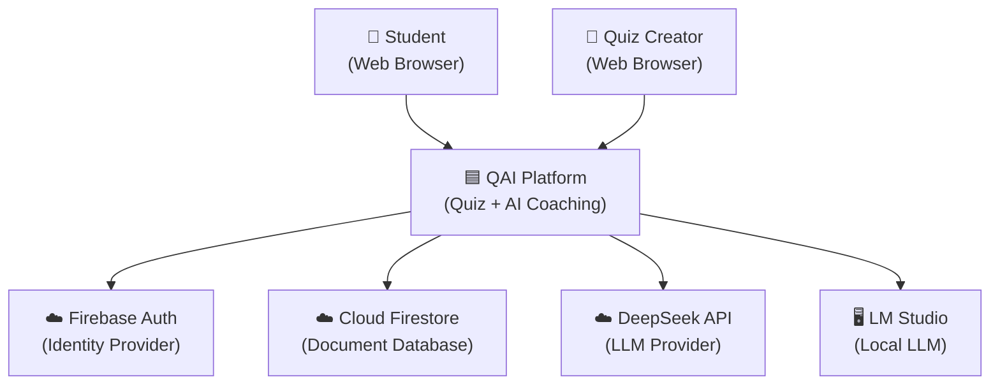
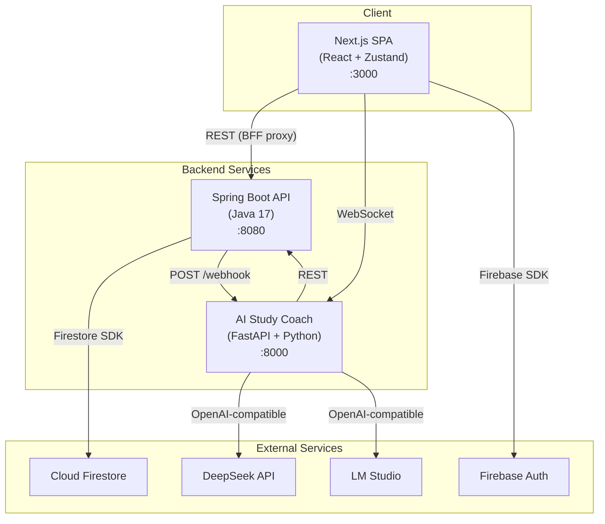
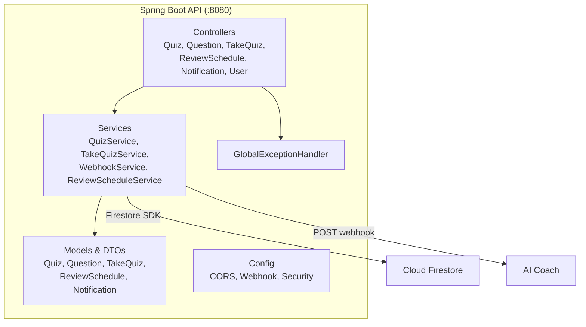
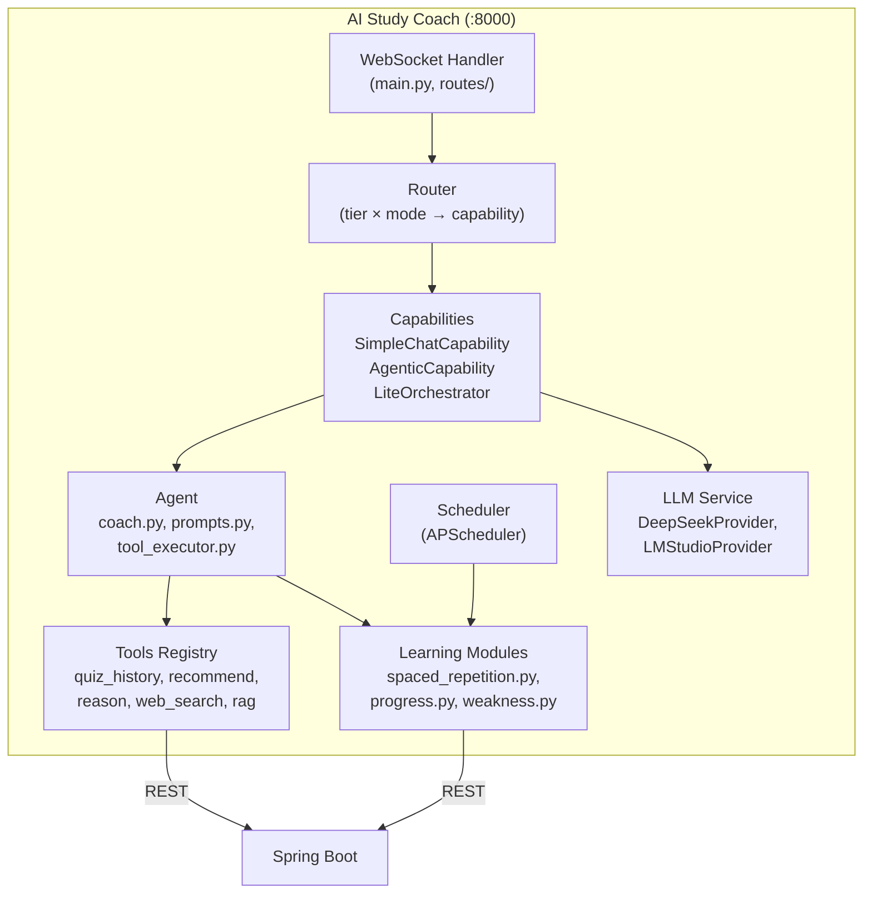
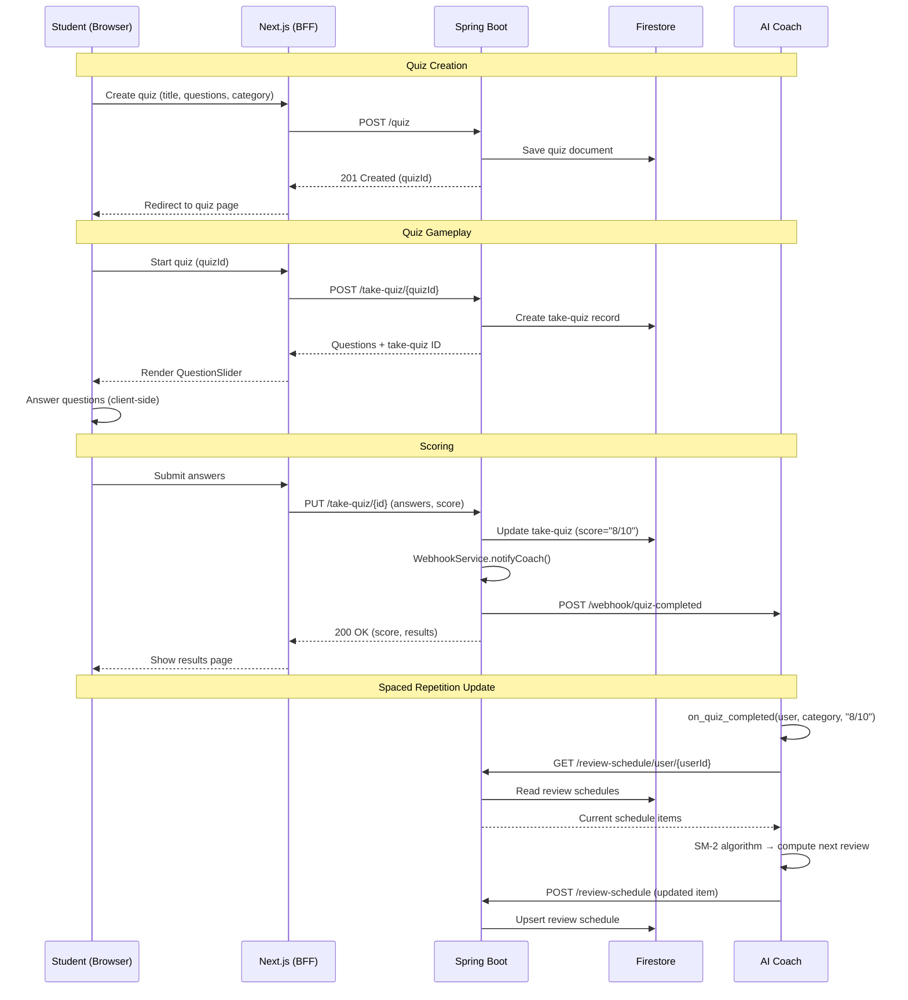
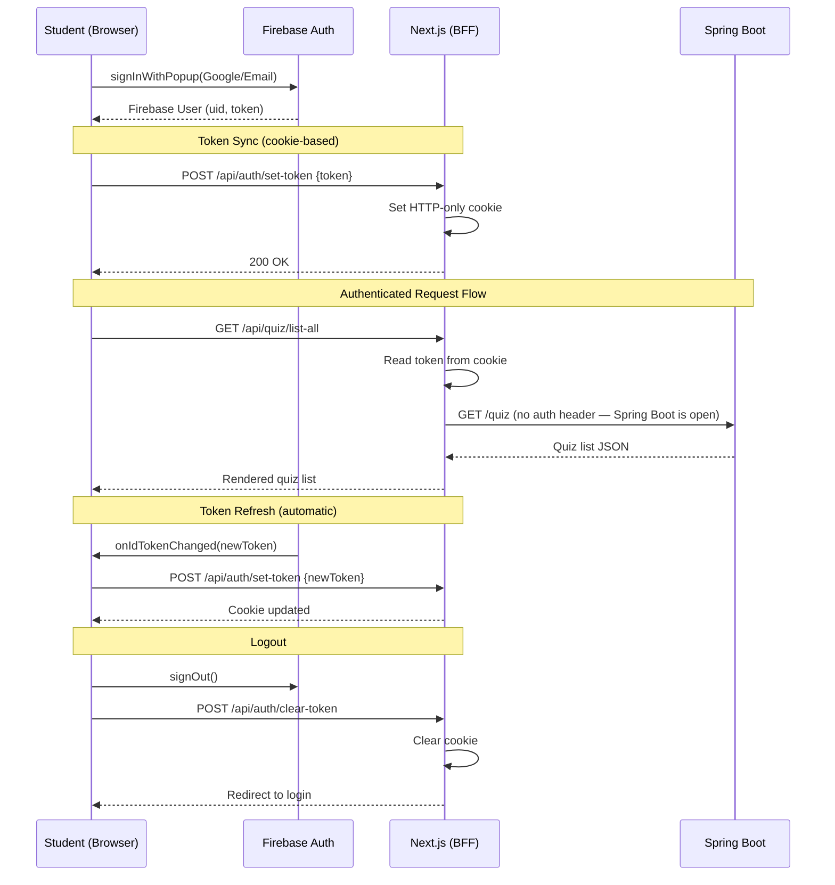
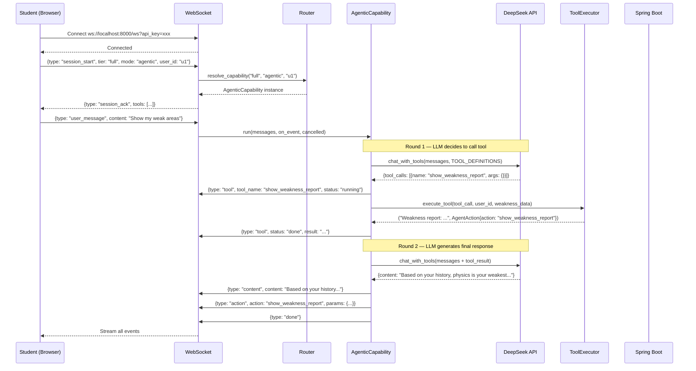
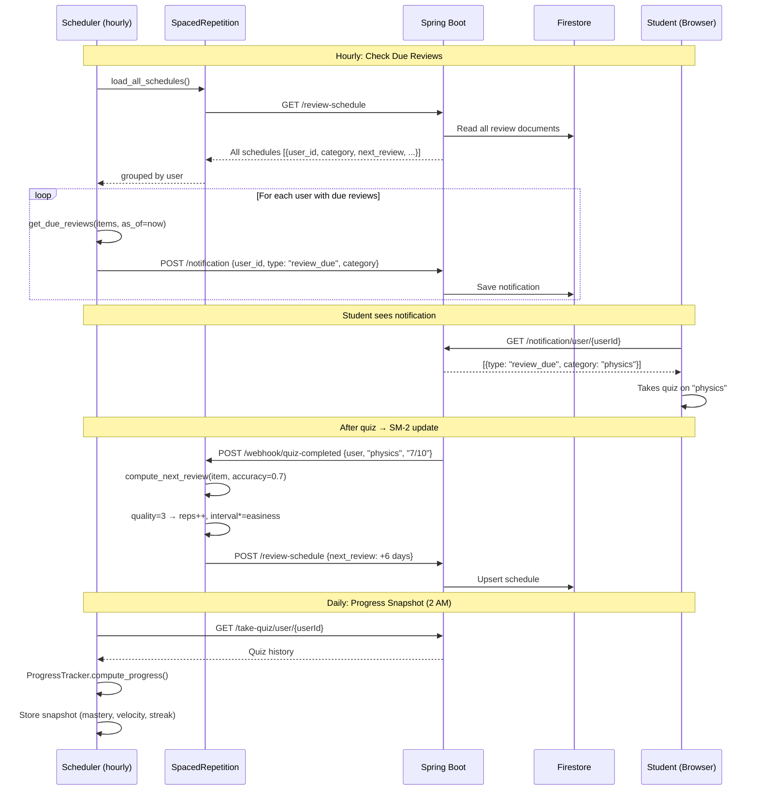

# QAI — Architecture Documentation

## Table of Contents
- [1. C4 Model Diagrams](#1-c4-model-diagrams)
- [2. Sequence Diagrams](#2-sequence-diagrams)
- [3. Environment Variables](#3-environment-variables)
- [4. Architecture Decision Records](#4-architecture-decision-records)

---

## 1. C4 Model Diagrams

### 1.1 Context Diagram (Level 1)



### 1.2 Container Diagram (Level 2)



### 1.3 Component Diagram (Level 3) — Spring Boot



### 1.4 Component Diagram (Level 3) — AI Study Coach



---

## 2. Sequence Diagrams

### 2.1 Quiz Creation → Play → Scoring → Review Schedule



### 2.2 User Login → Token Sync → Authenticated Requests



### 2.3 AI Coach Chat → Tool Call → Response



### 2.4 Spaced Repetition Scheduling Cycle



---

## 3. Environment Variables

### 3.1 Frontend (Next.js)

| Variable | Required | Default | Description |
|----------|----------|---------|-------------|
| `NEXT_PUBLIC_REST_API_URL` | Yes | — | Spring Boot base URL (`http://localhost:8080`) |
| `NEXT_PUBLIC_STUDY_COACH_API_URL` | No | `http://localhost:8000` | AI Coach WebSocket/REST URL |
| `NEXT_PUBLIC_STUDY_COACH_TIER` | No | `lite` | AI Coach tier (`lite` or `full`) |
| `NEXT_PUBLIC_FIREBASE_API_KEY` | Yes | — | Firebase Web API key |
| `NEXT_PUBLIC_FIREBASE_AUTH_DOMAIN` | Yes | — | Firebase auth domain |
| `NEXT_PUBLIC_FIREBASE_PROJECT_ID` | Yes | — | Firebase project ID |
| `NEXT_PUBLIC_FIREBASE_STORAGE_BUCKET` | Yes | — | Firebase storage bucket |
| `NEXT_PUBLIC_FIREBASE_MESSAGING_SENDER_ID` | Yes | — | FCM sender ID |
| `NEXT_PUBLIC_FIREBASE_APP_ID` | Yes | — | Firebase app ID |
| `NEXT_PUBLIC_FIREBASE_MEASUREMENT_ID` | No | — | Google Analytics measurement ID |

### 3.2 Spring Boot

| Variable / Property | Required | Default | Description |
|---------------------|----------|---------|-------------|
| `spring.application.name` | — | `QuizzAIOnline` | Application name |
| `app.security.cors.allowed-origin-patterns` | No | `*` | CORS allowed origins |
| `coach.webhook.url` | No | `http://localhost:8000/webhook/quiz-completed` | AI Coach webhook endpoint |
| `coach.webhook.api-key` | No | — | API key for webhook auth (`${COACH_API_KEY}`) |
| `coach.webhook.enabled` | No | `true` | Enable/disable webhook calls |
| `GOOGLE_APPLICATION_CREDENTIALS` | Yes | — | Path to Firebase service account JSON |

### 3.3 AI Study Coach (Python)

All prefixed with `COACH_` (loaded by pydantic-settings).

| Variable | Required | Default | Description |
|----------|----------|---------|-------------|
| `COACH_QUIZ_API_URL` | No | `http://localhost:8080` | Spring Boot API base URL |
| `COACH_LM_STUDIO_URL` | No | `http://127.0.0.1:1234` | LM Studio local server URL |
| `COACH_EMBEDDING_MODEL` | No | `text-embedding-nomic-embed-text-v1.5` | Embedding model name |
| `COACH_EXTERNAL_LLM_PROVIDER` | No | `deepseek` | Full tier LLM provider |
| `COACH_EXTERNAL_LLM_API_KEY` | Yes* | — | DeepSeek/OpenAI API key (*required for Full tier) |
| `COACH_EXTERNAL_LLM_MODEL` | No | — | Model name (e.g., `deepseek-v4-flash`) |
| `COACH_LLM_TIMEOUT_SECONDS` | No | `300` | LLM request timeout |
| `COACH_SUPABASE_URL` | No | — | Supabase project URL (for RAG) |
| `COACH_SUPABASE_KEY` | No | — | Supabase anon/service key |
| `COACH_SEARCH_API_KEY` | No | — | Web search API key |
| `COACH_DATABASE_URL` | No | `sqlite+aiosqlite:///./study_coach.db` | Local database URL |
| `COACH_API_KEY` | No | — | API key for endpoint protection |
| `COACH_CORS_ORIGINS` | No | `http://localhost:3000,http://localhost:8080` | Allowed CORS origins |
| `COACH_SCHEDULER_ENABLED` | No | `true` | Enable APScheduler jobs |
| `COACH_REVIEW_CHECK_INTERVAL_HOURS` | No | `1` | How often to check due reviews |
| `COACH_PROGRESS_SNAPSHOT_HOUR` | No | `2` | Hour (UTC) for daily progress snapshot |
| `COACH_SR_DEFAULT_EASINESS` | No | `2.5` | SM-2 initial easiness factor |
| `COACH_SR_MIN_EASINESS` | No | `1.3` | SM-2 minimum easiness bound |

---

## 4. Architecture Decision Records (ADRs)

### ADR-001: Three-Service Architecture

**Status:** Accepted  
**Date:** 2024-01

**Context:**  
Need a quiz platform with AI coaching. Frontend requires reactive UI, backend requires Firestore access, and AI coach requires Python ML ecosystem.

**Decision:**  
Split into 3 services:
1. **Frontend** (Next.js) — SSR pages, BFF API routes, Firebase Auth client SDK
2. **Spring Boot** (Java) — Core business logic, Firestore CRUD, webhook orchestration
3. **AI Coach** (FastAPI) — LLM integration, agentic tool loops, learning algorithms

**Consequences:**  
- (+) Each service uses optimal language/framework for its role
- (+) Independent deployment and scaling
- (+) Clear ownership boundaries
- (-) Cross-service communication overhead (HTTP/WebSocket)
- (-) Deployment complexity (3 processes to manage)

---

### ADR-002: Algorithmic Learning vs LLM-Generated Analysis

**Status:** Accepted  
**Date:** 2024-02

**Context:**  
Spaced repetition, progress tracking, and weakness detection could be done by the LLM or by deterministic algorithms.

**Decision:**  
Use **deterministic algorithms** for all learning science:
- SM-2 for spaced repetition scheduling
- Exponential-decay weighted mastery scores
- Rule-based weakness detection (accuracy thresholds)

Use LLM only for:
- Natural language response generation
- Agentic tool selection
- Conversational coaching tone

**Consequences:**  
- (+) Testable (pure functions with predictable outputs)
- (+) Fast (no API calls for scheduling decisions)
- (+) Reliable (no hallucination in critical scheduling)
- (+) Cost-effective (LLM tokens only for conversations)
- (-) Less flexible (can't adapt SM-2 parameters via conversation)
- (-) Fixed heuristics may not suit all learners

---

### ADR-003: WebSocket for AI Chat Streaming

**Status:** Accepted  
**Date:** 2024-03

**Context:**  
AI responses take 2-15 seconds. Users need feedback during generation.

**Decision:**  
Use WebSocket for AI Coach communication:
- Client opens persistent connection on chat widget mount
- Server streams tokens as `content_chunk` events
- Tool calls produce `stage_event` and `tool_event` messages
- Connection supports `mode_switch` without reconnect

**Consequences:**  
- (+) Real-time token streaming (no polling)
- (+) Server-initiated events (tool progress, action commands)
- (+) Single connection for session lifecycle
- (-) More complex than REST (reconnection logic needed)
- (-) Harder to debug (no standard browser devtools for WS content)

---

### ADR-004: BFF Pattern (Next.js API Routes as Proxy)

**Status:** Accepted  
**Date:** 2024-01

**Context:**  
Frontend needs to call Spring Boot but should not expose backend URLs or pass tokens directly from browser.

**Decision:**  
Use Next.js API routes (`/pages/api/**`) as a Backend-For-Frontend (BFF):
- Browser → Next.js API route → Spring Boot
- Auth tokens stored in HTTP-only cookies (set via `/api/auth/set-token`)
- API routes attach tokens to Spring Boot requests when needed

**Consequences:**  
- (+) Backend URLs never exposed to client
- (+) Cookies are HTTP-only (XSS-safe token storage)
- (+) Can add server-side logic (caching, aggregation)
- (-) Extra hop adds latency (~5-10ms)
- (-) Need to maintain proxy routes for each Spring Boot endpoint

---

### ADR-005: Two-Tier LLM Strategy (Lite + Full)

**Status:** Accepted  
**Date:** 2024-04

**Context:**  
Want to support both offline/free usage (local LLM) and high-quality cloud inference.

**Decision:**  
Two tiers routed by `tier` parameter:
- **Lite** — LM Studio (local): rule-based intent classification → code-driven tool calls → local LLM for response
- **Full** — DeepSeek API (cloud): native function-calling, streaming, multi-round agentic loop

Both use the same `LLMService` interface (OpenAI-compatible API).

**Consequences:**  
- (+) Works offline with Lite tier (no API costs)
- (+) Full tier gets native tool-use from capable models
- (+) Same chat widget UI for both tiers
- (-) Lite tier responses are lower quality
- (-) Two code paths to maintain (LiteOrchestrator vs AgenticCapability)

---

### ADR-006: Firestore via Spring Boot (Not Direct)

**Status:** Accepted  
**Date:** 2024-01

**Context:**  
AI Coach needs to read/write review schedules and notifications, which live in Firestore.

**Decision:**  
AI Coach accesses Firestore **indirectly** through Spring Boot REST API, not directly via Firestore SDK.

**Consequences:**  
- (+) Single source of truth for data access logic
- (+) Spring Boot validates data before persistence
- (+) No Firestore credentials needed in AI Coach
- (+) Easier to swap database later (only Spring Boot changes)
- (-) AI Coach depends on Spring Boot being available
- (-) Extra HTTP hop for every data read/write

---

### ADR-007: Client-Side Action Dispatch (AgentAction)

**Status:** Accepted  
**Date:** 2024-04

**Context:**  
AI Coach decides "start quiz X" or "navigate to dashboard" but can't directly control the browser.

**Decision:**  
Tool executor returns `AgentAction` objects streamed to the frontend via WebSocket. Frontend's `onAction` handler executes them:
```json
{"action": "start_quiz", "params": {"quiz_id": "abc"}, "label": "Starting Math Quiz"}
```

The frontend maps actions to router pushes, API calls, or UI state changes.

**Consequences:**  
- (+) Clean separation: AI decides what, frontend decides how
- (+) Frontend can confirm/deny actions before executing
- (+) Actions are auditable (logged as events)
- (-) Frontend must implement handler for every action type
- (-) Actions may fail silently if frontend handler is incomplete
